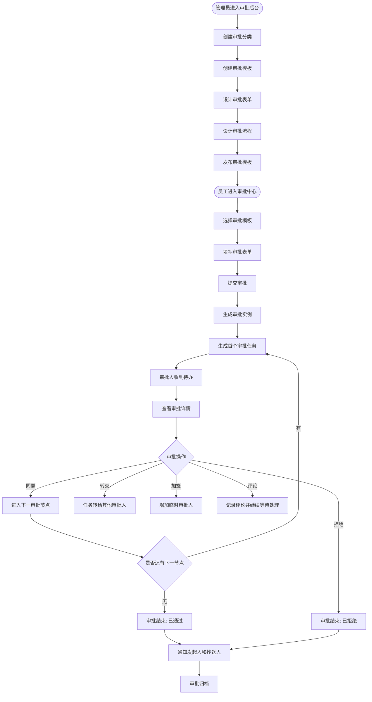
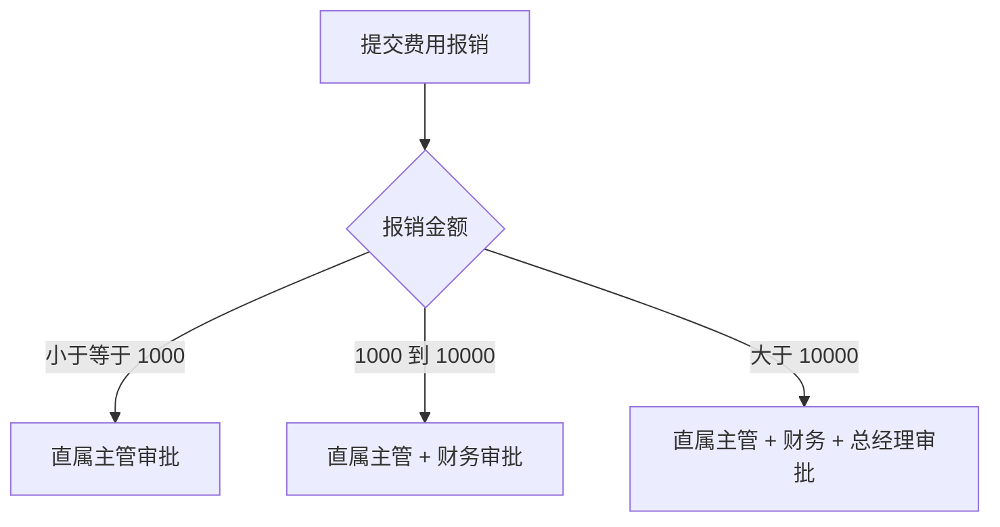
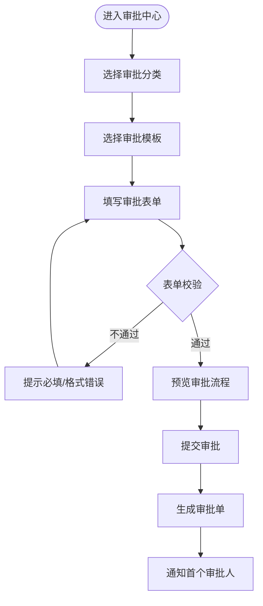
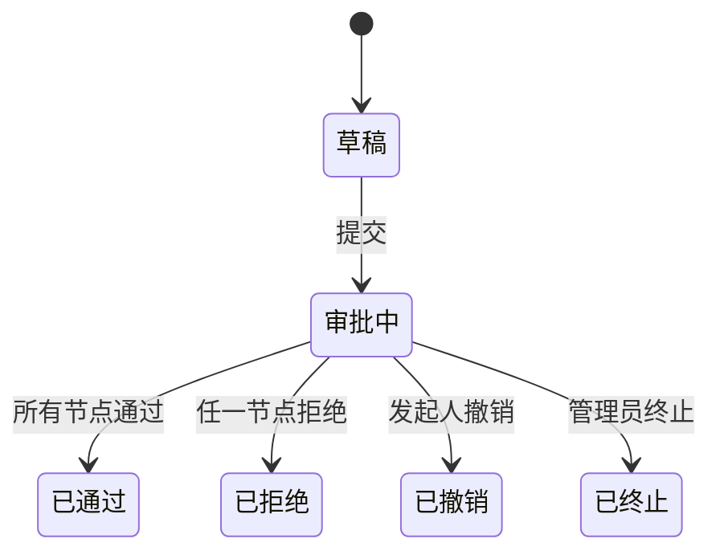
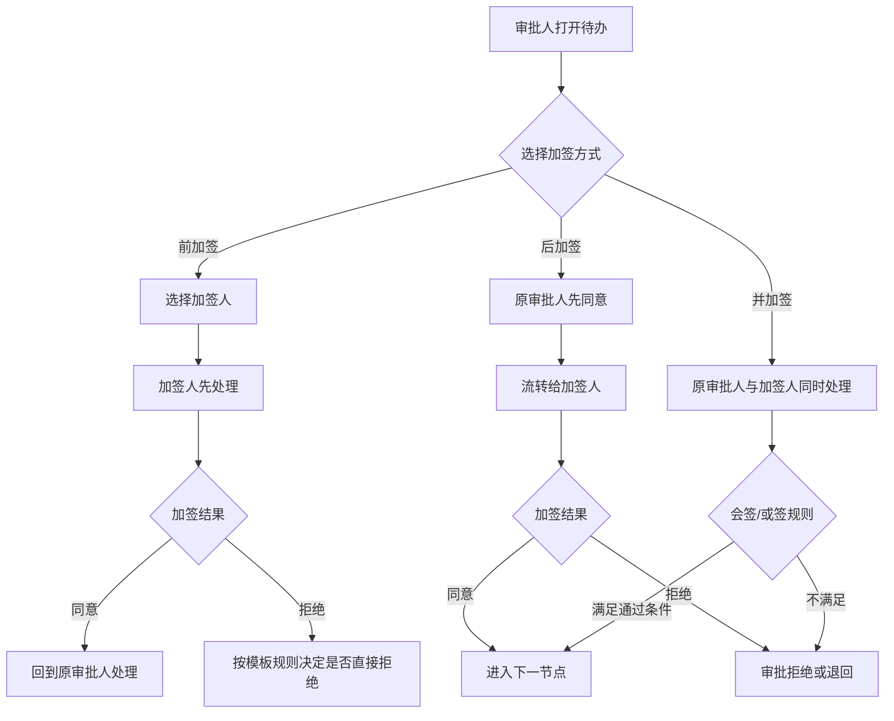
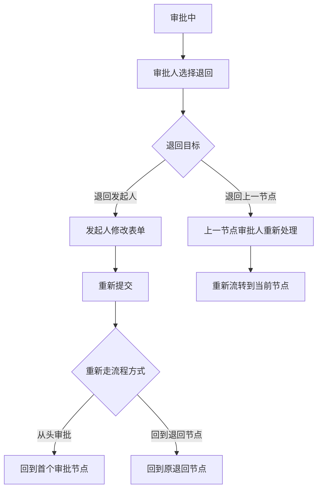
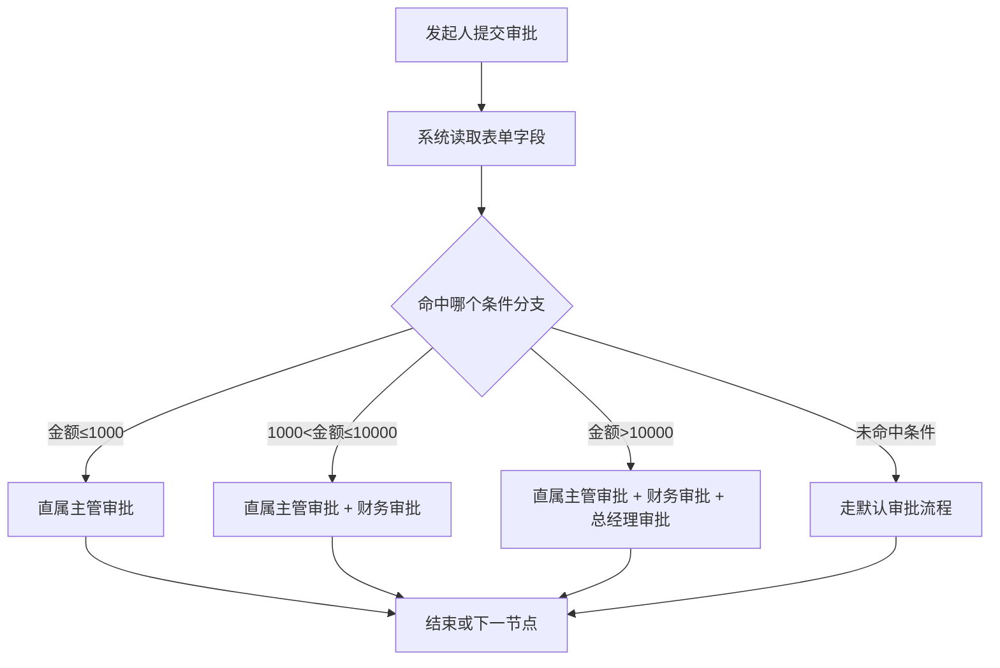

# OA 审批流程系统 PRD

> 说明：本文用于“自研一个类似钉钉 OA 审批的审批流程系统”。本文只整理产品需求、业务流程、页面结构和实现难点，不写钉钉开放平台接口参数、接口路径、鉴权方式等技术对接内容。

## 1. 文档目标

本文目标是把钉钉 OA 审批中可参考的产品能力，转译成一份可供 AI 或产品/研发继续设计的需求文档。

后续可基于本文继续生成：

1. 审批系统高保真原型。
2. PC 管理后台页面。
3. 移动端审批发起/审批处理页面。
4. 数据库表结构。
5. 后端接口设计。
6. 流程引擎技术方案。

## 2. 产品定位

OA 审批流程系统是企业内部用于“提交申请、流转审批、审批决策、过程留痕、结果归档”的通用工作流系统。

系统需要支持企业根据不同业务场景创建审批表单，例如：

| 审批场景 | 示例 |
|---|---|
| 人事类 | 请假、加班、出差、补卡 |
| 财务类 | 报销、付款申请、借款申请 |
| 行政类 | 用章、采购、物品领用 |
| 业务类 | 合同审批、客户授信、费用申请 |
| 自定义类 | 企业根据自身业务配置的任意审批 |

## 3. 核心用户角色

| 角色 | 使用端 | 主要职责 |
|---|---|---|
| 系统管理员 | PC 管理后台 | 管理组织、权限、审批分类、基础配置 |
| 审批管理员 | PC 管理后台 | 创建审批模板、配置表单、配置流程、发布/停用模板 |
| 发起人 | PC / 移动端 | 填写表单并提交审批 |
| 审批人 | PC / 移动端 | 查看待办，执行同意、拒绝、转交、加签等操作 |
| 抄送人 | PC / 移动端 | 接收审批结果或过程通知，只查看不处理 |
| 查看人/审计人 | PC 管理后台 | 查询审批记录、导出数据、追踪流程日志 |

## 4. MVP 产品边界

### 4.1 MVP 必须包含

| 模块 | MVP 能力 |
|---|---|
| 审批模板管理 | 新建、编辑、复制、停用、发布审批模板 |
| 表单设计 | 配置表单字段、必填、提示、默认值、字段排序 |
| 流程设计 | 配置审批节点、审批人、抄送人、条件分支 |
| 发起审批 | 用户选择模板，填写表单并提交 |
| 待办审批 | 审批人查看待审批单并执行同意/拒绝 |
| 审批详情 | 查看表单内容、流程进度、审批记录、评论 |
| 抄送通知 | 审批完成或指定节点触发抄送 |
| 审批记录 | 按状态、模板、发起人、时间查询审批单 |
| 权限控制 | 不同角色看到不同菜单和数据范围 |

### 4.2 MVP 暂不做或后置

| 暂不做 | 原因 |
|---|---|
| 复杂低代码表单 | MVP 先支持常用字段，不做完整低代码平台 |
| 复杂流程引擎 DSL | 先支持固定节点、条件分支、会签/或签基础能力 |
| 外部系统深度集成 | 后续按业务系统逐个接入 |
| 复杂自动化动作 | 如自动建群、自动归档、自动生成业务单据等后置 |
| 高级报表分析 | MVP 先做列表查询和导出 |
| 多租户 SaaS | 如果先做企业内部系统，可暂不设计多租户 |

## 5. 核心业务对象

| 对象 | 说明 |
|---|---|
| 审批分类 | 对模板进行分类管理，例如人事、财务、行政、业务 |
| 审批模板 | 一类审批的定义，包括模板名称、说明、适用范围、表单、流程 |
| 审批表单 | 发起人需要填写的字段集合 |
| 表单控件 | 单行文本、多行文本、数字、金额、日期、图片、附件、明细等 |
| 审批流程 | 审批单从发起到结束经过的节点、审批人和条件 |
| 审批实例 | 用户提交后生成的一张具体审批单 |
| 审批任务 | 某个审批节点分配给某个审批人的待办任务 |
| 审批记录 | 每次提交、同意、拒绝、转交、加签、撤销、评论等操作日志 |
| 抄送记录 | 发送给抄送人的通知和查看记录 |

## 6. 总体业务流程

## 7. 审批模板管理

### 7.1 模板列表

审批管理员可以在 PC 后台查看全部审批模板。

| 字段 | 说明 |
|---|---|
| 模板名称 | 如请假申请、费用报销、合同审批 |
| 所属分类 | 人事、财务、行政、业务等 |
| 启用状态 | 草稿、已发布、已停用 |
| 可见范围 | 全员可见、指定部门可见、指定角色可见 |
| 最近更新时间 | 模板最后修改时间 |
| 创建人 | 模板创建者 |

### 7.2 模板操作

| 操作 | 说明 |
|---|---|
| 新建模板 | 创建新的审批模板 |
| 编辑模板 | 修改表单或流程，已发布模板修改后需重新发布 |
| 复制模板 | 复制已有模板快速创建新模板 |
| 发布模板 | 发布后员工可发起该审批 |
| 停用模板 | 停用后员工不可再发起，历史审批单保留 |
| 删除模板 | 仅草稿模板可删除，已产生审批实例的模板不建议物理删除 |

## 8. 表单设计需求

### 8.1 表单设计目标

表单设计用于定义“发起人提交审批时需要填写什么信息”。

系统需要支持审批管理员通过可视化方式配置字段。

### 8.2 MVP 支持的字段类型

| 字段类型 | 使用场景 |
|---|---|
| 单行文本 | 姓名、标题、编号、简短说明 |
| 多行文本 | 申请原因、备注、说明 |
| 数字 | 天数、数量、分数 |
| 金额 | 报销金额、付款金额、预算金额 |
| 单选 | 申请类型、费用类型、是否需要合同 |
| 多选 | 多个业务标签、多项资源申请 |
| 日期 | 请假日期、申请日期、期望完成日期 |
| 日期区间 | 请假开始结束、出差开始结束 |
| 图片 | 现场照片、票据图片 |
| 附件 | 合同、发票、证明材料 |
| 联系人 | 相关员工、协同人 |
| 部门 | 申请部门、费用归属部门 |
| 明细表 | 多条费用明细、多个物品明细 |
| 说明文字 | 表单中的提示说明，不需要用户填写 |

### 8.3 字段配置项

| 配置项 | 说明 |
|---|---|
| 字段名称 | 发起人看到的字段标题 |
| 字段类型 | 文本、金额、日期、附件等 |
| 是否必填 | 必填字段未填写不能提交 |
| 输入提示 | 输入框中的 placeholder |
| 默认值 | 可配置固定默认值或当前用户/当前部门 |
| 是否只读 | 某些字段可展示但不可编辑 |
| 是否参与打印 | 决定审批单打印时是否展示 |
| 字段排序 | 控制表单展示顺序 |

### 8.4 表单设计页面

建议页面分为三栏：

| 区域 | 内容 |
|---|---|
| 左侧控件区 | 展示可拖拽字段类型 |
| 中间画布区 | 展示当前表单结构，可排序、选中字段 |
| 右侧属性区 | 配置当前字段的名称、必填、默认值、提示等 |

## 9. 流程设计需求

### 9.1 流程设计目标

流程设计用于定义“审批单提交后，谁来审批、按什么顺序审批、什么情况下走不同分支”。

### 9.2 节点类型

| 节点类型 | 说明 |
|---|---|
| 发起节点 | 员工填写表单并提交 |
| 审批节点 | 指定一个或多个审批人处理 |
| 条件分支 | 根据金额、部门、申请类型等字段进入不同审批路径 |
| 抄送节点 | 将审批单通知给相关人员 |
| 结束节点 | 审批通过、审批拒绝、审批撤销后结束 |

### 9.3 审批人配置方式

| 配置方式 | 说明 |
|---|---|
| 指定成员 | 固定某些员工作为审批人 |
| 指定角色 | 如部门负责人、财务、人事、行政 |
| 发起人直属主管 | 根据组织架构自动找到直属主管 |
| 发起人自选 | 发起审批时由发起人选择审批人 |
| 表单联系人字段 | 根据表单中选择的联系人作为审批人 |

### 9.4 审批方式

| 审批方式 | 说明 |
|---|---|
| 或签 | 多个审批人中任意一人同意即可通过该节点 |
| 会签 | 多个审批人都同意才通过该节点 |
| 顺序审批 | 多个审批人按配置顺序依次审批 |

### 9.5 条件分支

条件分支用于处理不同业务规则。

示例：

条件可基于以下字段：

| 条件来源 | 示例 |
|---|---|
| 金额字段 | 报销金额大于 10000 |
| 数字字段 | 请假天数大于 3 天 |
| 单选字段 | 申请类型为合同审批 |
| 部门字段 | 申请部门为销售部 |
| 发起人属性 | 发起人属于某个部门或角色 |

## 10. 发起审批需求

### 10.1 发起入口

| 入口 | 说明 |
|---|---|
| 审批中心首页 | 用户按分类选择审批模板 |
| 常用审批 | 展示用户最近使用或管理员推荐的模板 |
| 业务系统入口 | 后续可由业务系统跳转到指定审批模板 |

### 10.2 发起审批流程

### 10.3 发起页需要展示

| 区域 | 内容 |
|---|---|
| 模板标题 | 当前审批类型 |
| 表单内容 | 发起人需要填写的字段 |
| 审批流程预览 | 展示将要经过的审批人或节点 |
| 抄送人 | 展示固定或可选抄送人 |
| 提交按钮 | 提交后生成审批单 |
| 暂存草稿 | 可选，MVP 可后置 |

## 11. 审批处理需求

### 11.1 待办列表

审批人进入“待我审批”查看需要处理的审批单。

| 字段 | 说明 |
|---|---|
| 审批标题 | 模板名称 + 发起人 |
| 发起人 | 谁提交的审批 |
| 发起部门 | 发起人所属部门 |
| 当前节点 | 当前审批节点名称 |
| 提交时间 | 发起审批时间 |
| 紧急程度 | 可选字段，MVP 可不做 |
| 状态 | 待审批、已处理、已超时等 |

### 11.2 审批详情

审批详情页是审批系统的核心页面。

| 区域 | 内容 |
|---|---|
| 基础信息 | 标题、发起人、发起时间、审批状态 |
| 表单详情 | 发起人填写的全部表单字段 |
| 流程进度 | 当前到哪个节点，每个节点处理结果 |
| 操作区 | 同意、拒绝、转交、加签、评论 |
| 评论区 | 审批过程沟通记录 |
| 附件区 | 发起人上传的图片、文件 |
| 日志区 | 提交、审批、撤销、抄送等操作记录 |

### 11.3 审批操作

| 操作 | 说明 |
|---|---|
| 同意 | 当前节点通过，进入下一节点或结束 |
| 拒绝 | 审批单结束，状态变为已拒绝 |
| 转交 | 将当前待办转给其他人处理 |
| 加签 | 增加临时审批人 |
| 评论 | 不改变审批状态，仅记录沟通信息 |
| 撤销 | 发起人在允许范围内撤回审批 |

## 12. 审批状态设计

### 12.1 审批单状态

| 状态 | 说明 |
|---|---|
| 草稿 | 已填写但未提交 |
| 审批中 | 已提交，流程未结束 |
| 已通过 | 所有审批节点通过 |
| 已拒绝 | 审批人拒绝 |
| 已撤销 | 发起人主动撤回 |
| 已终止 | 管理员或系统终止 |

### 12.2 审批任务状态

| 状态 | 说明 |
|---|---|
| 待处理 | 当前审批人需要处理 |
| 已同意 | 当前审批人已同意 |
| 已拒绝 | 当前审批人已拒绝 |
| 已转交 | 当前任务转给其他人 |
| 已加签 | 当前节点追加了审批人 |
| 已失效 | 流程已结束，任务不再可处理 |

## 13. 通知与消息

系统需要在关键节点发送通知。

| 场景 | 通知对象 |
|---|---|
| 审批提交 | 首个审批人 |
| 节点流转 | 下一节点审批人 |
| 审批同意 | 发起人，可选通知抄送人 |
| 审批拒绝 | 发起人 |
| 审批撤销 | 已参与审批的人 |
| 审批完成 | 发起人、抄送人 |
| 评论/回复 | 被提及人员或审批参与人 |

## 14. 完整审批能力补充

当前文档前文已经覆盖基础审批流，但如果要做一个相对完整的 OA 审批系统，还需要把以下能力明确写进需求。否则后续 AI 或研发容易只做“提交、同意、拒绝”的简单审批，无法支撑真实企业场景。

### 14.1 审批节点类型完整清单

| 节点类型 | 是否建议 MVP 支持 | 说明 |
|---|---|---|
| 发起节点 | 必须 | 用户填写表单并提交审批 |
| 审批节点 | 必须 | 由一个或多个审批人处理 |
| 条件分支节点 | 必须 | 根据金额、部门、申请类型等条件走不同流程 |
| 抄送节点 | 必须 | 将审批单同步给指定人员，只读不处理 |
| 办理节点 | 可后置 | 非审批动作，例如行政执行、财务付款、采购下单 |
| 自动节点 | 可后置 | 系统自动执行动作，例如自动归档、自动生成编号 |
| 结束节点 | 必须 | 审批通过、拒绝、撤销、终止后结束 |

### 14.2 审批方式完整清单

| 审批方式 | 是否建议 MVP 支持 | 业务含义 | 通过规则 |
|---|---|---|---|
| 单人审批 | 必须 | 一个审批人处理 | 该审批人同意即通过 |
| 或签 | 必须 | 多个审批人中任意一人处理即可 | 任意一人同意即通过；任意一人拒绝可直接拒绝 |
| 会签 | 必须 | 多个审批人都需要处理 | 所有人同意才通过；任意一人拒绝则节点拒绝 |
| 依次审批 | 建议支持 | 多个审批人按顺序处理 | 前一人同意后流转给下一人 |
| 发起人自选审批人 | 可后置 | 发起时由用户选择审批人 | 按模板配置的规则校验人数和范围 |

### 14.3 加签能力

加签是完整审批系统中非常重要的能力，需要明确区分“前加签”和“后加签”。

| 加签类型 | 触发人 | 业务含义 | 流程表现 |
|---|---|---|---|
| 前加签 | 当前审批人 | 在自己审批前，先让其他人审批 | 加签人处理完成后，回到当前审批人 |
| 后加签 | 当前审批人 | 自己先审批，再让其他人补充审批 | 当前审批人同意后，流转给加签人 |
| 并加签 | 当前审批人 | 当前审批人与加签人共同处理 | 根据会签/或签规则判断节点是否通过 |

### 14.4 加签流程图

### 14.5 转交、委托、退回、撤销

| 能力 | 操作人 | 说明 | 是否建议 MVP 支持 |
|---|---|---|---|
| 转交 | 当前审批人 | 将当前审批任务转给另一个人处理，原审批人不再处理 | 建议支持 |
| 委托 | 审批人本人或管理员 | 在一段时间内将自己的审批任务自动委托给他人 | 可后置 |
| 退回到发起人 | 审批人 | 审批材料不完整时退回给发起人修改后重新提交 | 建议支持 |
| 退回到上一节点 | 审批人 | 当前节点认为上一节点需要重新确认 | 可后置 |
| 撤销 | 发起人 | 发起人在审批完成前主动撤回审批 | 建议支持 |
| 终止 | 管理员 | 管理员因流程错误或业务原因强制结束审批 | 可后置 |

### 14.6 退回与重新提交流程

### 14.7 条件审批

条件审批是审批流程设计器必须写清楚的核心能力。

| 条件类型 | 示例 | 说明 |
|---|---|---|
| 金额条件 | 报销金额 ≤ 1000、1000 < 金额 ≤ 10000、金额 > 10000 | 财务审批最常见 |
| 天数条件 | 请假天数 ≤ 1 天、> 3 天 | 人事审批常见 |
| 部门条件 | 发起部门为销售部、运营部、财务部 | 不同部门走不同负责人 |
| 申请类型条件 | 合同类型为采购合同、销售合同 | 不同业务走不同审批链 |
| 发起人条件 | 发起人为部门负责人、普通员工 | 特殊人员走特殊流程 |
| 表单字段条件 | 是否需要用章、是否涉及付款 | 根据表单选择项决定流程 |

### 14.8 条件审批流程图

### 14.9 审批人为空、重复审批人、自动跳过

完整审批系统必须定义异常规则，否则流程会卡住。

| 场景 | 建议规则 |
|---|---|
| 审批人为空 | 允许配置“自动通过 / 转交管理员 / 不允许提交” |
| 审批人与发起人相同 | 允许配置“自动跳过 / 仍需本人审批” |
| 连续节点审批人相同 | 允许配置“只审批一次 / 每个节点都审批” |
| 条件分支未命中 | 进入默认分支 |
| 抄送人为空 | 跳过抄送节点 |
| 审批人离职或停用 | 转交给管理员或部门负责人 |

### 14.10 超时与催办

| 能力 | 说明 | 是否建议 MVP 支持 |
|---|---|---|
| 审批超时提醒 | 待办超过指定时长后提醒审批人 | 建议支持 |
| 发起人催办 | 发起人主动提醒当前审批人 | 建议支持 |
| 自动升级 | 超时后自动提醒上级或管理员 | 可后置 |
| 超时自动通过/拒绝 | 风险较高，需谨慎配置 | 可后置 |

### 14.11 抄送规则

| 抄送方式 | 说明 |
|---|---|
| 发起时抄送 | 发起人提交时同步抄送 |
| 节点通过后抄送 | 某个审批节点通过后抄送 |
| 审批完成后抄送 | 审批最终通过或拒绝后抄送 |
| 固定抄送人 | 模板中固定配置 |
| 发起人自选抄送人 | 发起时由发起人选择 |
| 条件抄送 | 满足某些条件时才抄送 |

### 14.12 完整审批流转图

```mermaid
flowchart TD
    A([填写并提交审批]) --> B[表单校验]
    B --> C{是否通过校验}
    C -->|否| D[提示修改表单]
    D --> A
    C -->|是| E[生成审批实例]
    E --> F[根据条件分支计算审批路径]
    F --> G[生成当前节点审批任务]
    G --> H{审批节点类型}

    H -->|单人审批| I[单人处理]
    H -->|或签| J[多人任一处理]
    H -->|会签| K[多人全部处理]
    H -->|依次审批| L[多人按顺序处理]

    I --> M{审批操作}
    J --> M
    K --> M
    L --> M

    M -->|同意| N{是否还有下一节点}
    M -->|拒绝| O[审批结束: 已拒绝]
    M -->|前加签| P[加签人先处理后回到当前审批人]
    M -->|后加签| Q[当前审批人同意后流转给加签人]
    M -->|转交| R[任务转给新审批人]
    M -->|退回| S[退回发起人或上一节点]
    M -->|评论| T[记录评论，不改变流程]

    P --> M
    Q --> N
    R --> M
    S --> U{是否重新提交}
    U -->|是| F
    U -->|否| V[等待发起人修改]
    T --> M

    N -->|有| G
    N -->|无| W[审批结束: 已通过]

    W --> X[触发抄送/通知/归档]
    O --> X
```

### 14.13 审批操作完整清单

| 操作 | 改变流程状态 | 说明 |
|---|---|---|
| 提交 | 是 | 发起人提交审批，生成审批实例 |
| 同意 | 是 | 当前任务通过 |
| 拒绝 | 是 | 审批单结束，状态为已拒绝 |
| 前加签 | 是 | 在当前审批人前增加临时审批人 |
| 后加签 | 是 | 当前审批人同意后增加临时审批人 |
| 转交 | 是 | 当前任务处理人变更 |
| 退回 | 是 | 回到发起人或上一节点 |
| 撤销 | 是 | 发起人撤回审批 |
| 终止 | 是 | 管理员强制结束审批 |
| 催办 | 否 | 仅发送提醒 |
| 评论 | 否 | 仅记录沟通内容 |
| 抄送查看 | 否 | 只读查看 |

## 15. 查询与数据管理

### 15.1 用户侧列表

| 列表 | 说明 |
|---|---|
| 我发起的 | 当前用户提交过的审批 |
| 待我审批 | 当前用户需要处理的审批任务 |
| 我已审批 | 当前用户已处理的审批 |
| 抄送我的 | 当前用户收到的抄送审批 |

### 15.2 管理侧列表

| 列表 | 说明 |
|---|---|
| 全部审批单 | 管理员按权限查看审批数据 |
| 按模板查询 | 查看某类审批的所有记录 |
| 按状态查询 | 审批中、已通过、已拒绝、已撤销 |
| 按人员查询 | 发起人、审批人、部门 |
| 按时间查询 | 提交时间、完成时间 |
| 导出数据 | 导出审批记录和表单字段 |

## 16. PC 端页面清单

| 页面 | 说明 |
|---|---|
| 审批工作台 | 展示待办、已办、我发起、抄送我的 |
| 发起审批页 | 按分类选择审批模板并填写表单 |
| 审批详情页 | 查看表单、流程、日志、评论，并处理审批 |
| 审批模板列表 | 管理全部审批模板 |
| 表单设计器 | 可视化配置表单字段 |
| 流程设计器 | 配置审批节点、审批人、条件分支、抄送 |
| 审批数据查询 | 管理员查询和导出审批记录 |
| 审批分类管理 | 维护审批分类 |
| 权限管理 | 配置审批管理员、模板可见范围、数据权限 |

## 17. 移动端页面清单

| 页面 | 说明 |
|---|---|
| 审批首页 | 展示常用审批、待我审批、我发起的 |
| 发起审批页 | 移动端填写表单并提交 |
| 待办列表 | 查看待处理审批任务 |
| 审批详情页 | 查看审批内容并执行同意/拒绝 |
| 评论页 | 查看和发布评论 |
| 抄送列表 | 查看抄送给我的审批 |

## 18. 数据模型建议

### 18.1 审批模板

| 字段 | 说明 |
|---|---|
| template_id | 模板 ID |
| template_name | 模板名称 |
| category_id | 所属分类 |
| description | 模板说明 |
| visibility_scope | 可见范围 |
| status | 草稿、已发布、已停用 |
| version | 模板版本 |
| created_by | 创建人 |
| updated_at | 更新时间 |

### 18.2 表单字段

| 字段 | 说明 |
|---|---|
| field_id | 字段 ID |
| template_id | 所属模板 |
| field_name | 字段名称 |
| field_type | 字段类型 |
| required | 是否必填 |
| placeholder | 输入提示 |
| default_value | 默认值 |
| sort_order | 排序 |

### 18.3 流程节点

| 字段 | 说明 |
|---|---|
| node_id | 节点 ID |
| template_id | 所属模板 |
| node_type | 节点类型 |
| node_name | 节点名称 |
| approver_type | 审批人类型 |
| approve_mode | 或签、会签、顺序审批 |
| condition_rule | 条件规则 |
| sort_order | 节点顺序 |

### 18.4 审批实例

| 字段 | 说明 |
|---|---|
| instance_id | 审批单 ID |
| template_id | 来源模板 |
| title | 审批标题 |
| initiator_id | 发起人 |
| department_id | 发起部门 |
| form_data | 表单数据 |
| status | 审批状态 |
| current_node_id | 当前节点 |
| created_at | 发起时间 |
| completed_at | 完成时间 |

### 18.5 审批任务

| 字段 | 说明 |
|---|---|
| task_id | 任务 ID |
| instance_id | 审批实例 |
| node_id | 所属节点 |
| approver_id | 审批人 |
| status | 任务状态 |
| action | 同意、拒绝、转交等 |
| comment | 审批意见 |
| handled_at | 处理时间 |

### 18.6 加签/转交记录

| 字段 | 说明 |
|---|---|
| change_id | 变更记录 ID |
| instance_id | 审批实例 |
| task_id | 原审批任务 |
| change_type | 前加签、后加签、转交、退回 |
| from_user_id | 原处理人 |
| to_user_id | 新增或转交处理人 |
| reason | 操作原因 |
| created_at | 操作时间 |

### 18.7 审批日志

| 字段 | 说明 |
|---|---|
| log_id | 日志 ID |
| instance_id | 审批实例 |
| operator_id | 操作人 |
| action_type | 提交、同意、拒绝、加签、转交、退回、撤销、评论等 |
| action_result | 操作结果 |
| comment | 操作意见 |
| created_at | 操作时间 |

## 19. 权限设计

| 权限点 | 说明 |
|---|---|
| 模板管理权限 | 谁可以创建、编辑、发布模板 |
| 模板可见权限 | 哪些人可以发起该模板 |
| 审批处理权限 | 只有当前审批人可处理当前任务 |
| 数据查看权限 | 发起人、审批人、抄送人、管理员可查看不同范围数据 |
| 导出权限 | 仅管理员或授权人员可导出审批数据 |

## 20. 难度评估

### 20.1 整体难度

如果只做 MVP，难度为中等；如果要做到接近钉钉的完整 OA 审批能力，难度较高。

| 范围 | 难度 | 原因 |
|---|---|---|
| 固定审批模板 + 固定流程 | 低 | 每类审批写死字段和流程即可 |
| 可配置表单 + 简单流程 | 中 | 需要表单设计器、流程配置、动态表单渲染 |
| 可配置表单 + 条件分支 + 会签/或签 | 中高 | 需要流程引擎和规则判断 |
| 完整类钉钉 OA 审批 | 高 | 需要组织架构、权限、流程引擎、消息、移动端、审计、扩展能力 |

### 20.2 主要难点

| 难点 | 说明 | 建议 |
|---|---|---|
| 动态表单 | 不同模板字段不同，提交和展示都要动态渲染 | MVP 先支持 10 个左右常用控件 |
| 流程引擎 | 审批节点、条件分支、会签/或签会增加复杂度 | 先做线性流程，再加条件分支 |
| 组织架构 | 直属主管、部门负责人依赖组织数据准确 | MVP 可先用指定成员/角色审批 |
| 权限控制 | 谁能看、谁能审、谁能导出必须严谨 | 从第一版就设计数据权限 |
| 移动端体验 | 审批高频发生在手机端 | 移动端详情页和待办列表必须优先设计 |
| 审计留痕 | 审批系统涉及责任追踪 | 所有操作必须写日志 |
| 模板变更 | 已发布模板修改后，历史审批单如何展示 | 模板需要版本号，历史实例绑定历史版本 |
| 加签/转交/退回 | 临时改变流程处理人或流程位置，容易造成状态混乱 | 单独建操作记录和任务变更记录 |
| 条件分支冲突 | 多个条件同时命中或都不命中 | 必须配置优先级和默认分支 |

## 21. 推荐 MVP 实施路径

### 21.1 第一阶段：能跑通审批

| 模块 | 内容 |
|---|---|
| 模板管理 | 新建模板、发布模板 |
| 表单字段 | 单行文本、多行文本、数字、金额、日期、附件 |
| 流程配置 | 固定审批人、指定角色审批 |
| 发起审批 | 填表提交 |
| 待办审批 | 同意、拒绝 |
| 审批详情 | 表单、流程、日志 |

### 21.2 第二阶段：可配置增强

| 模块 | 内容 |
|---|---|
| 条件分支 | 按金额、部门、类型走不同流程 |
| 抄送 | 固定抄送、发起人自选抄送 |
| 转交/加签 | 审批过程中临时调整处理人 |
| 评论 | 审批单内沟通 |
| 移动端优化 | 待办提醒、快速审批 |

### 21.3 第三阶段：管理与集成

| 模块 | 内容 |
|---|---|
| 数据导出 | 按模板导出审批数据 |
| 报表 | 审批效率、审批量、超时统计 |
| 外部系统 | 与业务单据、财务、人事系统打通 |
| 自动化 | 审批通过后自动触发业务动作 |

